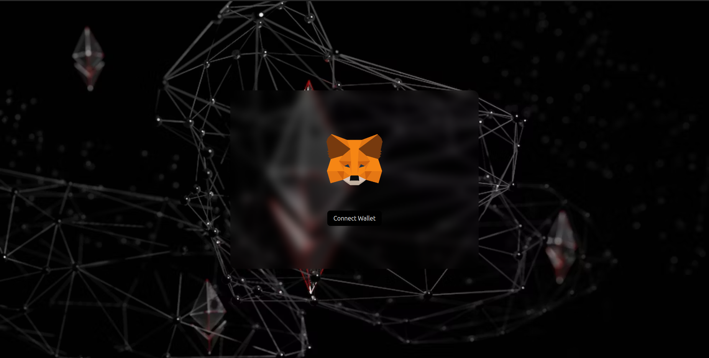
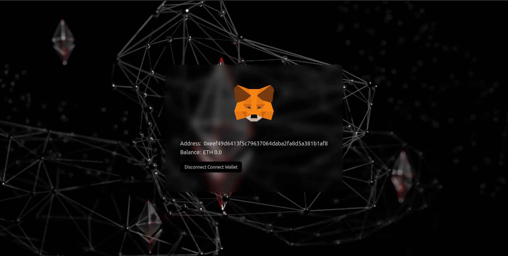

# Web3

Description:

A responsive web application, connect with your MetaMask wallet and shows the details such as Address and Balance.

How to run the application:

Step 1: Clone the repository using below line of code: 
https://github.com/div-vik/web3.git

Step 2: Open VS code editor and in the terminal write "npm i" to install all required packages.

Step 3: Open browser and copy & paste the below url: 
http://localhost:5173/

Tech Stacks:

-> ReactJS  
-> TailwindCSS  
-> Vite  
